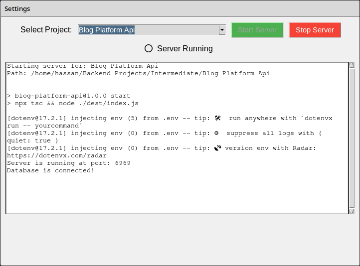

# StartServer - GUI Node.js Project Manager

A lightweight Python Tkinter app to start and manage Node.js servers from a local folder of projects. Logs are shown live, and the app remembers your project directory across sessions.


## 📦 Features

* 🔍 Set and persist the root folder for your Node.js projects
* 🧠 Remembers configuration between runs (`config.json`)
* 🚀 Start a Node.js server (`npm start`) for any project
* 📋 View real-time logs inside the GUI
* 🔴🟢 Visual status indicator for server running/stopped
* 🛑 Stop server via UI
* 🪟 Simple, clean interface using Tkinter


## 🧰 Requirements

* Python 3.x
* Node.js installed and accessible via `npm` in terminal
* Each project should have a `package.json` with a `start` script


## 🚀 Getting Started

Clone the repository and run the app:

```
git clone https://github.com/your-username/StartServer.git
cd StartServer
python app.py
```

Optional: Use a virtual environment

```
python -m venv .myenv
source .myenv/bin/activate    # Linux/macOS
.myenv\Scripts\activate       # Windows
```


## 📂 Usage

1. Open the app
2. Go to **Settings > Set Project Folder** to choose a root directory
3. Enter the name of the project folder (must exist in the selected directory)
4. Click **Start Server**
5. Logs will appear in real-time
6. Click **Stop Server** to terminate the process


## 📁 Project Structure

```
StartServer/
├── app.py           # Main application file
├── config.json      # Auto-generated config (ignored by git)
├── README.md
├── .gitignore
└── requirements.txt
```


## 📝 License

MIT License


## 📸 Screenshots




## 🤝 Contributing

Pull requests are welcome. For major changes, please open an issue first to discuss what you'd like to change.


## 📫 Contact

Made with ❤️ by [Muhammad Hassan](https://github.com/ZoanType)
